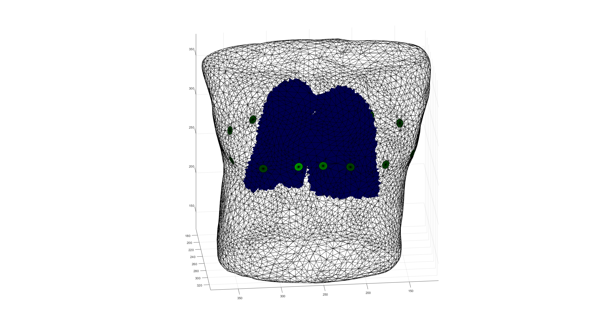
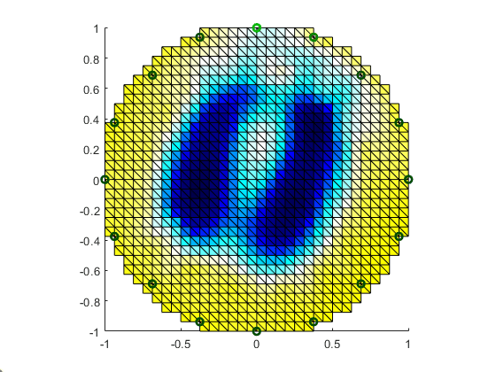
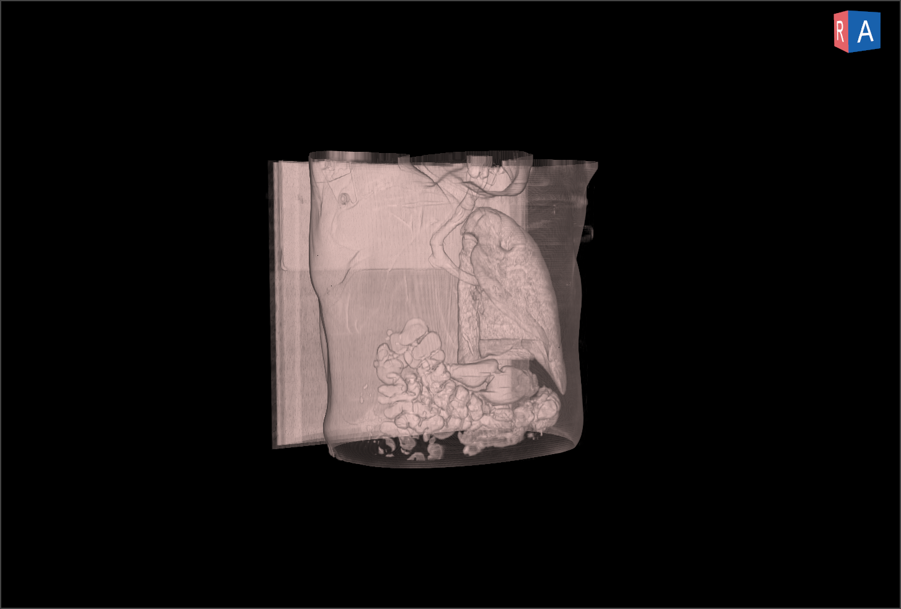
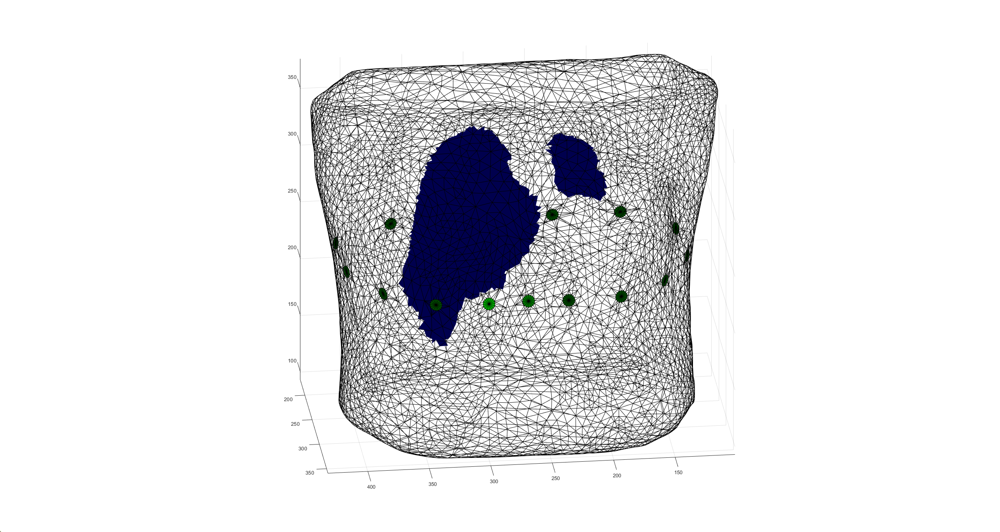
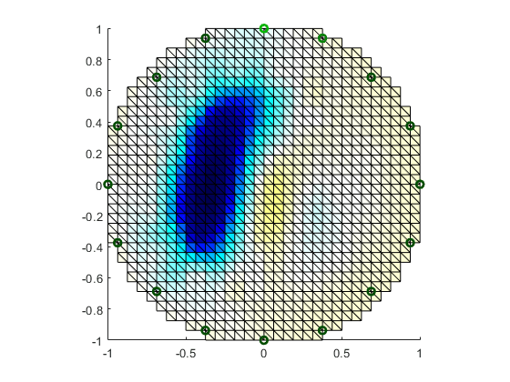

# StructEIT

**StructEIT** is a project that generates FEM datasets suitable for Electrical Impedance Tomography (EIT) from CT scans.

*Tutorial_1.m* demonstrates how to use the dataset together with **EIDORS** to perform **forward** and **inverse** EIT computations.

Taking *LIDC-IDRI-0001* as an example:

- **Fig. 1** shows the thoracic model used in the forward problem.
- **Fig. 2** shows the reconstructed image obtained using the **Sheffield sensitivity-based reconstruction method**.

  
  

---

## Prerequisites

Before running this tutorial, you **must** have a working **EIDORS** environment installed.

This project is compatible with the following EIDORS versions:

- `eidors-v3.10-ng`
- `eidors-v3.12-ng`

---

## Dataset Notes

This project generates the **Chest-EIT dataset** using  publicly available CT scan datasets:

- **LIDC-IDRI**
- **NSCLC**

Please note that **not all CT scans correspond to healthy subjects**.  
For example, some cases (e.g., *NSCLC-LUNG1-362*) contain missing or abnormal anatomical regions.

Users are advised to **carefully select samples** according to the specific requirements of their own research or application.

  
  
  

---

